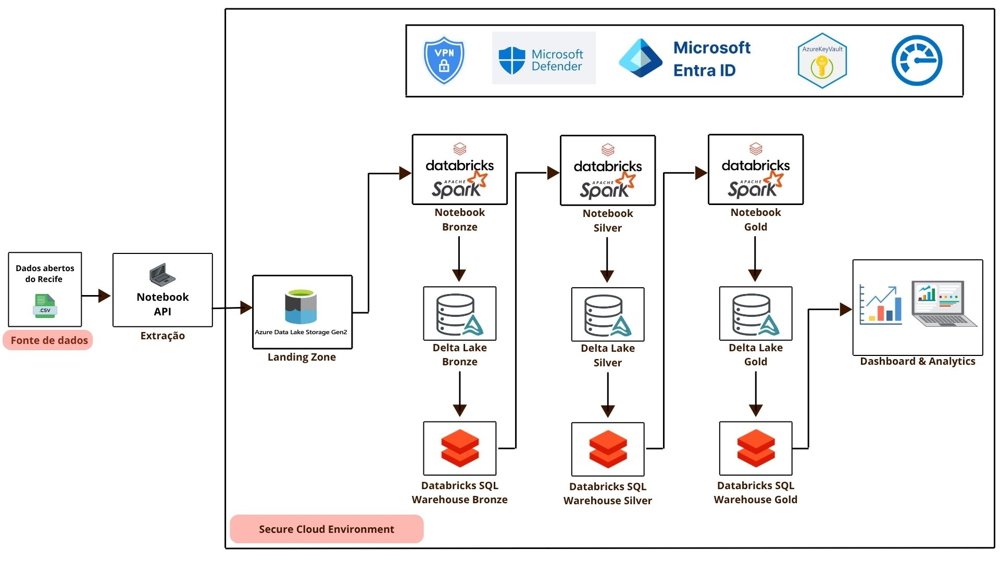
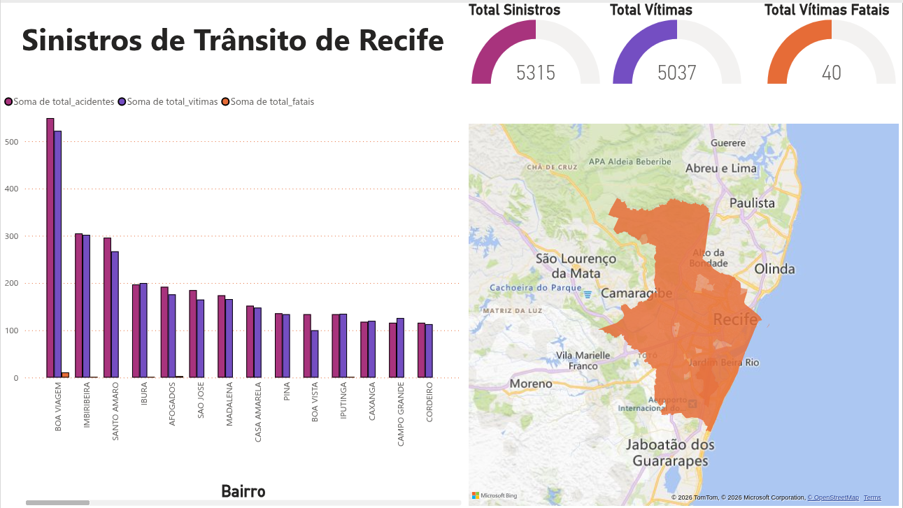
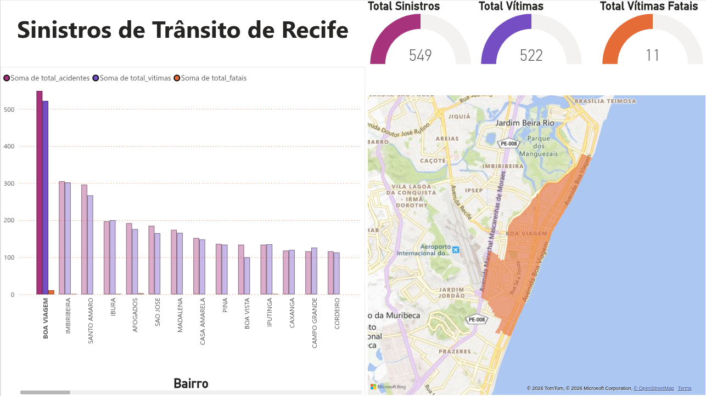
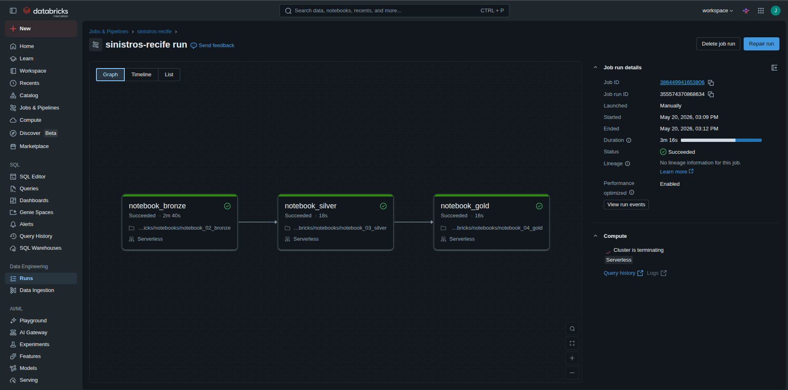
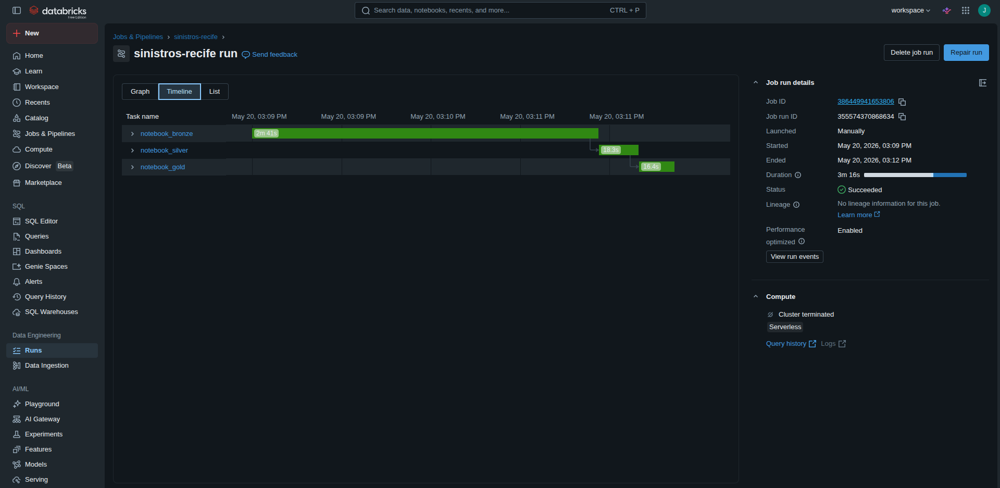
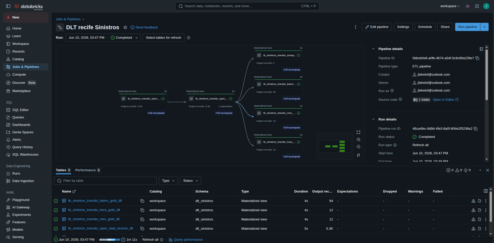

# Pipeline de Engenharia de Dados com Databricks

Neste repositório, implementamos um projeto de engenharia de dados de ponta a ponta utilizando dados de sinistros de trânsito da cidade do Recife obtidos através da [API de Dados Abertos do Recife](https://dados.recife.pe.gov.br/es/dataset/acidentes-de-transito-com-e-sem-vitimas/resource/87ac4237-f5f9-44d2-bcf1-927aaa0a2d31). Os dados apresentados neste projeto correspondem a ocorrências reais de sinistros de trânsito. A análise tem caráter exclusivamente analítico e busca contribuir para discussões relacionadas à mobilidade urbana e segurança no trânsito, sempre com respeito às vítimas e seus familiares. O objetivo deste trabalho é desenvolver uma pipeline de dados baseada na arquitetura Medallion utilizando Databricks, PySpark e Delta Lake, passando pelas camadas Bronze, Silver e Gold até a construção de análises e dashboards analíticos. Durante o desenvolvimento do projeto, foram realizadas etapas de ingestão, limpeza, tratamento, padronização e modelagem dos dados, garantindo maior qualidade, organização e confiabilidade das informações para fins analíticos.

## Arquitetura da pipeline

Na Figura 1, apresentamos a arquitetura da pipeline desenvolvida neste projeto.

  

  <em>Figura 1: Arquitetura da pipeline baseada na arquitetura Medallion.</em>

Na Figura 1, observamos toda arquitetura da pipeline desenvolvida neste projeto. Utilizamos a plataforma Databricks Free Edition devido à sua integração nativa com Apache Spark e Delta Lake, permitindo o desenvolvimento de pipelines de engenharia de dados de forma escalável e organizada. Além disso, a plataforma fornece um ambiente unificado para ingestão, processamento, armazenamento, análise e visualização dos dados, facilitando a implementação da arquitetura Medallion utilizada neste projeto. Ao longo do projeto também utilizamos a linguagem Python e algumas de suas bibliotecas como Pyspark e Numpy. Para trabalhar com tabelas, utilizamos SQL. 

Vamos explicar como cada etapa da pipeline foi desenvolvida. 

### Fonte  e extração dos dados

Os dados explorados neste trabalho foram obtidos a partir dos dados públicos de Sinistros de Trânsito com e sem vitimas do ano 2024 da capital pernambucana, Recife, disponibilizados pela [API de Dados Abertos do Recife](https://dados.recife.pe.gov.br/es/dataset/acidentes-de-transito-com-e-sem-vitimas/resource/87ac4237-f5f9-44d2-bcf1-927aaa0a2d31). Utilizamos o notebook **API.ipynb** para fazer a requisição dos dados **data.csv**. 

A partir de agora, entraremos na estrutura medallion do pipeline. Esta estrutura é formada por três camadas, Bronze, Silver e Gold. A estrutura Medallion define como os dados evoluem e como cada camada está relacionada, de modo que a qualidade dos dados aumente. Cada camada será representada por um schema. Vamos descrever o que foi feito em cada camada desta estrutura de forma bem detalhada. 

Para criar os bancos de dados da estrutura medallion, utilizamos o **notebook_01_medallion.ipynb**. Neste notebook, usamos **SQL** para criar cada um dos bancos de dados, bronze, silver e gold. Vamos para a camada Bronze. 

### Bronze

Nesta etapa do pipeline, a camada Bronze é a primeira da estrutura Medallion. Aqui iremos fazer a ingestão dos dados brutos, isto é, da mesma forma como foi obtido pela API. Nesta etapa, não fazemos nenhum tratamento nos dados. A principal função da camada bronze é servir como uma base para recuperar os dados originais sempre que for necessário. Nesta etapa, adicionamos 4 colunas. Uma delas foi a **data_carga_lake**.  Essa coluna registra quando os dados foram carregados no Data Lake, sendo essencial para auditoria, rastreabilidade e controle de versões dos dados. As outras três foram apenas uma extração de dia, mês e ano da coluna **data** dos dados originais. 

Feito isso, salvamos os dados brutos na camada Bronze. Nesta etapa, os dados são gravados utilizando o formato Delta Lake, que é construído sobre arquivos Parquet. O Parquet é um formato de armazenamento colunar, permitindo maior eficiência na compressão e melhor desempenho em consultas, pois apenas as colunas necessárias são lidas durante o processamento. O Delta Lake adiciona funcionalidades importantes ao Parquet, como controle de versão, transações ACID e suporte a cargas incrementais. Isso garante maior confiabilidade no processamento de dados, evitando inconsistências e permitindo operações como inserção, atualização e merge de dados.

Além disso, será criada uma tabela externa no catálogo do Databricks, apontando para os arquivos armazenados no Data Lake. Dessa forma, os dados podem ser consultados via SQL sem a necessidade de duplicação, facilitando a integração com ferramentas analíticas e de visualização. Com essa abordagem, obtemos um pipeline mais eficiente, escalável e confiável para o processamento de grandes volumes de dados. Todo este processo da camada Bronze está presente no **notebook_02_bronze.ipynb**. Agora, iremos para a camada Silver. 

### Silver

Nesta etapa da pipeline, os dados passaram por um tratamento profundo de refinamento. Para entender todo o processo realizado nesta etapa vamos falar um pouco da estrutura dos dados obtidos. Os dados da camada Bronze foram inicialmente carregados com 41 colunas e 5315 registros. Como os dados foram obtidos diretamente da API pública, a maior parte das colunas foi inicialmente interpretada como `object`, exigindo posteriormente um processo de tipagem e padronização na camada Silver. Um exemplo da estrutura dos dados está mostrado na tabela abaixo:

| Coluna      | Tipo inicial |
|--------------|--------------|
| Protocolo    | object |
| data         | object |
| hora         | object |
| bairro       | object |
| vitimas      | object |
| ano          | int32 |
| mes          | int32 |
| dia          | int32 |

Nesta etapa é fundamental uma análise exploratória. Primeiro verificamos se havia linhas duplicadas, mas não existiam. Logo após, detectamos colunas totalmente vazias ou com menos de 50% dos dados devidamente preenchidos. Removemos todas estas colunas, pois nenhuma informação útil poderia ser encontrda com elas. Para garantir total privacidade dos dados, removemos os identificadores de protocolo. Algumas colunas que deveriam ser preenchidas com números inteiros, estavam declaradas como string. Por exemplo, algo que deveriam ser 0, 1, ou 2, estavam escritas com vírgula, ou seja, 0,0, 1,0, 2,0. Além de ocupar muita memória, armazenar os dados desta forma também atrapalham em análises numéricas, logo, fizemos uma convenção de 0,0 -> 0, 1,0 -> 1 e assim por diante. Por fim, padronizamos os valores nulos encontrados em algumas colunas, entradas que não estavam preenchidas, colocamos 'NA'. 

Após o processo de tipagem e limpeza dos dados, observamos uma redução superior a 40% no tamanho do DataFrame em memória. Essa otimização melhora a eficiência no armazenamento e processamento dos dados, reduzindo o consumo de memória e aumentando o desempenho das operações analíticas realizadas ao longo da pipeline. Logo após, fizemos a persistência dos dados na camada Silver em formato Delta Lake (Parquet). 

Embora o cenário atual não envolva ingestão incremental, a utilização do Delta Lake garante que o pipeline esteja preparado para evoluções futuras, mantendo escalabilidade e robustez. Após a gravação dos dados, será criada uma tabela no catálogo do Databricks (Unity Catalog), permitindo consultas via SQL diretamente sobre os dados armazenados no Data Lake, sem necessidade de duplicação. Essa abordagem assegura um fluxo de dados eficiente, confiável e alinhado com boas práticas de engenharia de dados. Todo este processo da camada Silver está presente no **notebook_03_silver.ipynb**. Agora, vamos para a camada Gold. 

### Gold

A camada Gold da arquitetura medallion é a etapa da pipeline de dados responsável pela disponibilização de dados refinados, agregados e prontos para consumo analítico. Nessa camada, são aplicadas regras de negócio, métricas e transformações que permitem gerar insights estratégicos, dashboards e análises preditivas.

Como o projeto utiliza dados de sinistros de trânsito da cidade do Recife, o foco da camada Gold foi a construção de tabelas analíticas capazes de responder questões relevantes para a mobilidade urbana e segurança no trânsito. Entre os exemplos de análises desenvolvidas estão: bairros com maior número de acidentes, horários de maior ocorrência, tipos de veículos mais envolvidos em sinistros e meios de transporte associados a acidentes fatais.

Além disso, foram criadas métricas agregadas e tabelas otimizadas para visualização em dashboards no Databricks, permitindo uma análise mais eficiente dos padrões de acidentes ao longo do tempo e do espaço urbano. O objetivo final dessa camada é transformar os dados processados em informações úteis para apoiar tomadas de decisão, planejamento urbano e possíveis ações de prevenção de acidentes. Todo processo aplicado na camada Gold está presente no **notebook_04_gold.ipynb**. Agora, vamos para a etapa final da pipeline, Analytics. 
 

### Dashboard & Analytics 

A etapa Analytics é a parte final da nossa pipeline de dados, ela é responsável pela exploração visual e interpretação dos dados processados na camada Gold. Nesta etapa, os dados refinados são utilizados para construir gráficos, dashboards e indicadores que auxiliam na identificação de padrões e tendências relacionadas aos sinistros de trânsito em Recife. A camada Analytics permite que gestores, analistas e usuários finais obtenham insights relevantes para apoiar tomadas de decisão e estratégias voltadas à mobilidade urbana e segurança no trânsito.

  
  

  <em>Figura 2: Construção do Dashboard no Power Bi.</em>

O produto final do projeto foi um dashboard com algumas das possíveis anélises. Como o objetivo deste trabalho é focado em engenharia de dados, não fora realizado uma análise mais profunda. O dashboard foi construído na plataforma do Databricks. Através do SQL Warehouse do Databricks, foi possível recuperar todas as informações (tabelas) produzidas na camada Gold. Também é possível compartilhar as tabelas da camaga gold com a plataforma de visualização de dados da Microsoft, [Power Bi](https://www.microsoft.com/pt-br/power-platform/products/power-bi). O dashboard criado na plataforma power Bi pode ser visualizado na Figuras 2. Na imagem temos um dashboard interativo com o número total de sinistros, vitimas e vítimas fatais e, ao lado direito, temos um mapa para auxiliar com informação geográfica.

 

  

  <em>Figura 3: Construção do Dashboard no Databricks.</em>

Na Figura 3, observamos a interface da plataforma do Databricks. Na imagem podemos observar o título do dashboard, um total de 5320 acidentes, 5040 vítimas e o número total de 40 vítimas fatais. Logo abaixo temos um gráfico de barras interativo indicando o número total de acidentes por bairro. O restante do dashboard é formado por mais alguns gráficos, iremos discutir os resultados de forma detalhada. 

### Distribuição de acidentes por bairro:

Na Figura 4 temos uma distribuição da participação de cada bairro no número total de acidentes. O gráfico está no formato de pizza e cada fatia representa o percentual de acidentes por bairro. Como podemos observar, Boa Viagem foi o bairro do Recife que mais ocorreu acidentes em 2024, com 10.33% dos acidentes totais. Em segundo, temos Imbiribeira com 5.74% e em terceiro Santo Amaro com 5,57%. O gráfico é interativo e te permite consultar cada bairro encontrado nos dados. 

 

  

  <em>Figura 4: Distribuição de acidentes por bairro.</em>

### Total de acidentes por hora:

Na Figura 5, observamos um gráfico de área com o total de acidentes entre as primeiras 12 horas do dia. Aqui podemos observar que os dados estão limitados apenas a estes horários, logo, nossa análise será limitada apenas a estes horários do dia. No entanto, podemos concluir que no período de 1h e 12h, os horários entre 6h e 8h concentram o maior número de acidentes. Nos outros horários temos uma média de 400 acidentes por hora, enquanto que o horários destacado, entre 6h e 8h possuem uma média de 600 acidentes por hora. Isto ocorre devido ao maior fluxo devido ao horário de pico. 

 

  

  <em>Figura 5: Total de acidentes por hora.</em>

### Acidentes por meio de transporte:

Por último, iremos fazer uma nálise por meio de transporte. Como podemos observar na Figura 6, carros e motos foram os que mais se envolveram em acidentes, isto ocorre devido ao fato de serem os meios de transporte mais comuns. Outro fator que devemos considerar é o cruzamento de dados, tivemos um total de 5320 acidentes, mas se fizermos uma soma entre o total de acidentes com participação de moto com os acidentes com envolvimento de carros a soma resultará em 6000. Isto ocorre devido as colisões ocorridas, dois ou mais tipos de transporte podem participar de um único acidente. 

 

  

  <em>Figura 6: Total de acidentes por meio de transporte.</em>

Como moto e carro são mais comuns, é natural que causem mais acidentes. Logo, torna-se obrigatório observar a taxa de fatalidade de cada transporte, isto é, a razão entre o número total de acidentes fatais por tipo de veículo e o número total de acidentes causados por tipo de transporte. Observamos maior fração de acidentes com vítimas fatais em: caminhão, ciclista, pedestres e "outros" como mostra na Figura 7. A categoria “outros” representa meios de transporte não classificados nas categorias principais ou registros genéricos presentes na base de dados. 

 

  

  <em>Figura 7: Acidentes fatais por meio de transporte.</em>

Outros gráficos explorados podem ser visualizados no diretório **imgs** deste repositório. 

## Segurança, Governança e Monitoramento

Um ponto crucial deste projeto é que, embora tenha sido desenvolvido no **Databricks Free Edition** (que possui limitações de segurança por ser uma versão gratuita), a arquitetura foi pensada para um **cenário corporativo real**, adotando as melhores práticas do **Databricks Unity Catalog**.

### Governança de Dados com Unity Catalog

O Unity Catalog nos permite monitorar todos os fluxos e ciclos de vida dos dados de ponta a ponta, centralizando a governança e mapeando automaticamente o lineage (linhagem) desde a ingestão bruta até a tabela que alimenta o dashboard final. Para organizar e proteger o ecossistema de dados, mapeamos o pipeline dentro da estrutura de três níveis do Unity Catalog (`catalog.schema.table`):

* **Organização em Schemas:** Criamos um catálogo centralizado onde cada camada da arquitetura Medallion é representada por um **Schema** (`bronze`, `silver` e `gold`), garantindo total isolamento lógico dos dados.
* **Tabelas Não Gerenciadas (Unmanaged Tables) na Bronze:** Na camada Bronze, os dados brutos da API são registrados como tabelas externas. Utilizamos o conceito de **External Locations** para mapear os arquivos diretamente no Cloud Storage. Isso garante que, se uma tabela for excluída acidentalmente (`DROP TABLE`), os arquivos físicos originais permanecem intactos no storage para fins de auditoria.
* **Tabelas Gerenciadas (Managed Tables) na Silver e Gold:** À medida que os dados são limpos e agregados, eles passam a ser salvos como *Managed Tables*. O Unity Catalog assume o controle total sobre o ciclo de vida e a performance desses dados em formato Delta Lake, otimizando as consultas que alimentam o dashboard final.

### Segurança dos Dados no Processo de ETL

Para garantir que os dados de sinistros do Recife circulem de forma protegida, a pipeline segue estas diretrizes:

* **Criptografia em Trânsito e Repouso:** Todo o consumo da API de Dados Abertos é feito via protocolos seguros (**HTTPS/TLS**). No armazenamento, os dados são persistidos no Data Lake com criptografia de ponta, protegendo as informações contra acessos não autorizados.
* **RBAC (Controle de Acesso):** A estrutura de schemas do Unity Catalog permite aplicar permissões específicas (usando comandos como `GRANT`), garantindo que o acesso às tabelas seja restrito apenas ao necessário para cada nível de análise.
* **Tratamento de Dados Sensíveis:** Como mencionado na camada Silver, realizamos a remoção de protocolos e identificadores, garantindo a privacidade e a conformidade com boas práticas de proteção de dados.

### Proposta de Arquitetura Segura (Cenário Azure)

Caso este projeto fosse escalado para um ambiente de produção na **Microsoft Azure**, a arquitetura apresentada na **Figura 1** seria reforçada com:

* **Microsoft Entra ID & MFA:** Para autenticação centralizada e camadas extras de verificação no login.
* **Azure Key Vault:** Para gerenciar com segurança as chaves da API e credenciais de acesso, evitando que segredos fiquem expostos no código dos notebooks.
* **VNETs e Firewalls:** Isolamento de rede para garantir que o tráfego de dados ocorra dentro de um ambiente controlado e privado, longe da internet pública.
* **Microsoft Defender for Cloud:** Monitoramento proativo para identificar ameaças e vulnerabilidades na infraestrutura do Data Lake.

### Estratégia de Monitoramento e Qualidade

O monitoramento é o que garante que o dashboard da Figura 2 esteja sempre atualizado e confiável. Minha estratégia foca em:

#### Observabilidade do Pipeline
Utilizo os **Logs de Auditoria** do Databricks para registrar cada execução dos notebooks. Em um cenário ideal, ferramentas como o **Azure Monitor** seriam integradas para disparar alertas automáticos caso a ingestão da API falhe ou a latência dos dados ultrapasse o SLA (Acordo de Nível de Serviço) esperado.

#### Métricas de Performance e Qualidade
Para manter a saúde dos dados, acompanho de perto estas métricas:
* **Latência:** O tempo total que o dado leva desde a extração na API até estar pronto para o Dashboard na camada Gold.
* **Taxa de Erros:** Monitoramento de falhas de tipagem ou registros malformados durante o refinamento na camada Silver.
* **Integridade e Completude:** Verificamos o percentual de campos obrigatórios (como 'bairro' ou 'tipo de veículo') preenchidos, garantindo que a análise final seja precisa e livre de lacunas.

#### Ferramentas de Apoio
Além das métricas nativas do Databricks, a arquitetura prevê o uso de **Log Analytics** para consultas profundas sobre o comportamento histórico do pipeline e o **SQL Warehouse** para monitorar a performance das consultas que alimentam nossas visualizações analíticas.

## Orquestração e Automação de Pipelines (Databricks Jobs)

Para transformar esse pipeline analítico em um processo automatizado, robusto e produtivo, implementamos uma estratégia de orquestração utilizando o **Databricks Jobs**. O objetivo é garantir que as transformações e atualizações das camadas ocorram de forma sequencial, respeitando as dependências do fluxo de dados.

### Arquitetura do Job no Databricks Free Edition

Devido às limitações da versão gratuita do Databricks (que não possui suporte nativo para requisições de rede externas/APIs robustas ou execução de determinados drivers locais), a etapa de extração inicial (**API.ipynb**) foi executada localmente para gerar o arquivo `data.csv`. 

A partir do momento em que o dado bruto é disponibilizado no ambiente, a orquestração foi desenhada como um grafo de dependências (DAG) composto por **3 tasks sequenciais**:

1. **Task 1 (Camada Bronze):** Executa o `notebook_02_bronze.ipynb`, que lê os novos dados brutos e realiza a carga inicial (*append*) na tabela externa da Bronze, adicionando os metadados de auditoria.
2. **Task 2 (Camada Silver):** Disparada automaticamente após o sucesso da Task 1. Executa o `notebook_03_silver.ipynb` para aplicar as regras de limpeza, tipagem, tratamento de nulos e otimização de memória.
3. **Task 3 (Camada Gold):** Disparada após o sucesso da Task 2. Executa o `notebook_04_gold.ipynb`, atualizando as tabelas agregadas e recalculando as métricas de negócio que alimentam as visões analíticas.

> **Nota de Limitação:** No Databricks Free Edition, este Job é disparado manualmente para simular o comportamento de uma esteira produtiva. Na Figura 8 podemos visualizar a orquestração na interface do Databricks. 

  
  

  <em>Figura 8: Orquestração de notebooks utilizando o Databricks Jobs.</em>

### Cenário Ideal e Escalabilidade na Azure

Em um ambiente corporativo real utilizando o **Azure Databricks**, esse fluxo seria totalmente ponta a ponta e agendado (*Scheduled Time-Based* ou *Event-Driven* via Azure Data Factory / Airflow):

* **Task Zero Integrada:** O notebook `API.ipynb` seria a primeira Task do Job, rodando nativamente dentro do cluster conectado à internet de forma segura. Ele faria a requisição diária/horária dos dados novos na API de Dados Abertos do Recife e salvaria diretamente em um *Mount Point* do Azure Blob Storage ou ADLS Gen2.
* **Atualização Automática do Dashboard:** Com o uso de tabelas Delta e o **Databricks SQL Warehouse**, qualquer nova execução bem-sucedida do Job propagaria as atualizações instantaneamente até a camada Gold. Ferramentas como o **Power BI** (utilizando o modo *DirectQuery*) ou os próprios **Dashboards nativos do Databricks** refletiriam os novos sinistros de trânsito automaticamente, sem necessidade de qualquer intervenção humana.

## Delta Live Tables

Como alternativa à orquestração via Databricks Jobs com notebooks individuais, o mesmo pipeline foi reimplementado utilizando **Delta Live Tables (DLT)**, um framework declarativo nativo do Databricks para construção de pipelines ETL confiáveis e escaláveis.

 

  

  <em>Figura 9: Pipeline ETL implementado com Delta Live Tables.</em>

Na Figura 9, observamos a interface do pipeline DLT após uma execução completa e bem-sucedida, realizada em **1 minuto e 11 segundos**. O painel é dividido em três áreas principais: o grafo do pipeline (centro-esquerda), os detalhes do pipeline (direita) e a listagem das tabelas produzidas (inferior).

### Grafo do Pipeline

O grafo representa visualmente o DAG (Directed Acyclic Graph) do pipeline, evidenciando as dependências entre as camadas:

- A tabela **Bronze** (`tb_sinistros_transito_open_data_bronze_dlt`) é o ponto de entrada, lendo os dados brutos do CSV e produzindo **5.3K registros**.
- A tabela **Silver** (`tb_sinistros_transito_open_data_silver_dlt`) depende diretamente do Bronze, aplicando limpeza, tipagem e remoção de duplicatas, também com **5.3K registros** e **1 expectation** ativa (validação do campo `bairro`).
- A partir do Silver, **4 tabelas Gold são processadas em paralelo**, cada uma com ✅ verde:
  - `tb_sinistros_transito_transporte_gold_dlt` → **9 registros** (um por modal)
  - `tb_sinistros_transito_bairro_gold_dlt` → **94 registros** (um por bairro)
  - `tb_sinistros_transito_mes_gold_dlt` → **12 registros** (um por mês)
  - `tb_sinistros_transito_hora_gold_dlt` → **12 registros** (horas presentes nos dados)

Todas as tabelas foram geradas com **Full recompute**, modalidade equivalente ao `overwrite` dos notebooks originais.

### Detalhes do Pipeline e Governança

No painel direito, observamos que o pipeline está registrado como **ETL pipeline** no catálogo `workspace`, schema `dlt_sinistros`, com todas as tabelas do tipo **Materialized view**. O Run status indica **Completed**, com **0 erros, 0 warnings e 0 falhas**, confirmando a integridade total da execução. O pipeline também expõe o **Pipeline ID** e o **Run ID**, facilitando rastreabilidade e auditoria.

### Comparativo com a Abordagem por Notebooks

Em relação à orquestração via Databricks Jobs, o DLT oferece vantagens estruturais relevantes: as dependências entre tabelas são declaradas no próprio código (via `dlt.read()`), eliminando a necessidade de configuração manual de tasks sequenciais. Além disso, o DLT gerencia automaticamente a ordem de execução, o controle de qualidade via expectations e a materialização incremental — tornando o pipeline mais robusto, legível e preparado para evoluções futuras como ingestão incremental e monitoramento contínuo de qualidade dos dados.

## Como executar este projeto?

Para executar este projeto, é necessário que você possua uma conta no databricks free edition.

Como o databricks free edition possui algumas limitações, foi necessário rodar o notebook **API.ipynb** localmente para obter os dados no arquivo **data.csv**. Logo após, criamos um diretório no **Workspace** do Databricks e inserimos todos os outros notebooks encontrados no diretório **notebooks** deste repositório. 

Agora, dentro do Databricks, executamos:

##### 1: o **notebook_01_medallion** para criar os Catalogs e Schemas necessários na arquitetura medallion;

##### 2: Na aba **Data Ingestion** criamos um volume chamado **dbs** e fazemos a ingestão do arquivo **data.csv**;

##### 3: executamos o **notebook_02_bronze**; 

##### 4: executamos o **notebook_03_silver**; 

##### 5: executamos o **notebook_04_gold**; 

##### 6: executamos o **notebook_05_analytics** e poderemos observar alguns gráficos obtidos usando bibliotecas de visualização do Python;

##### 7: Finalmente podemos montar nosso dashboard com o **SQL Warehouses**. Temos um arquivo .json neste repositório, você pode realizar o upload na plataforma do databricks. 

